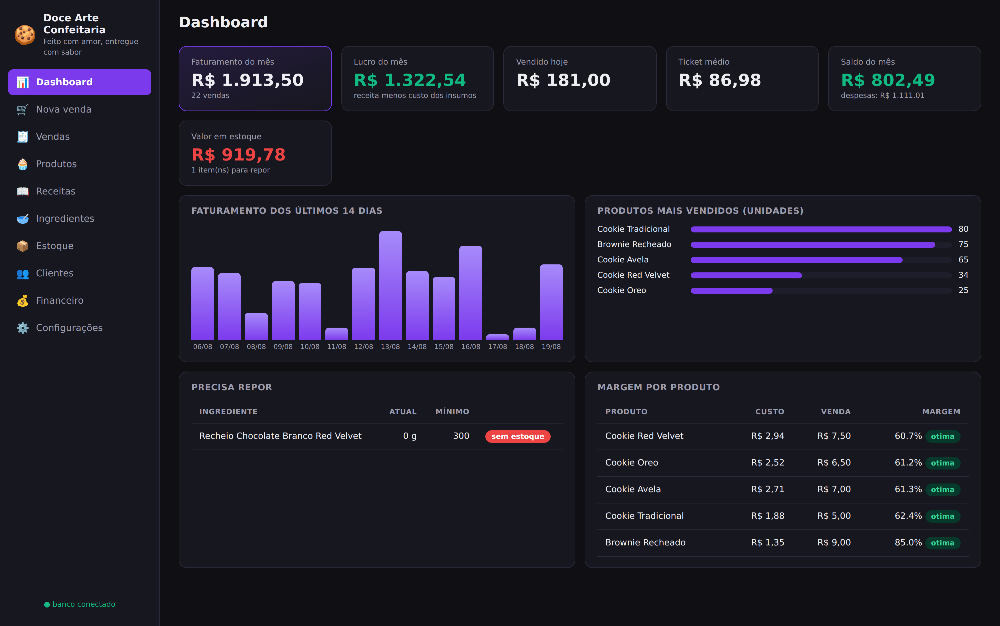
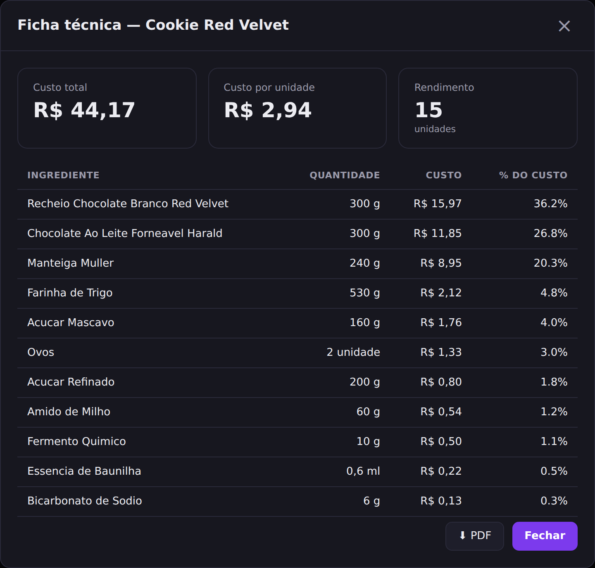
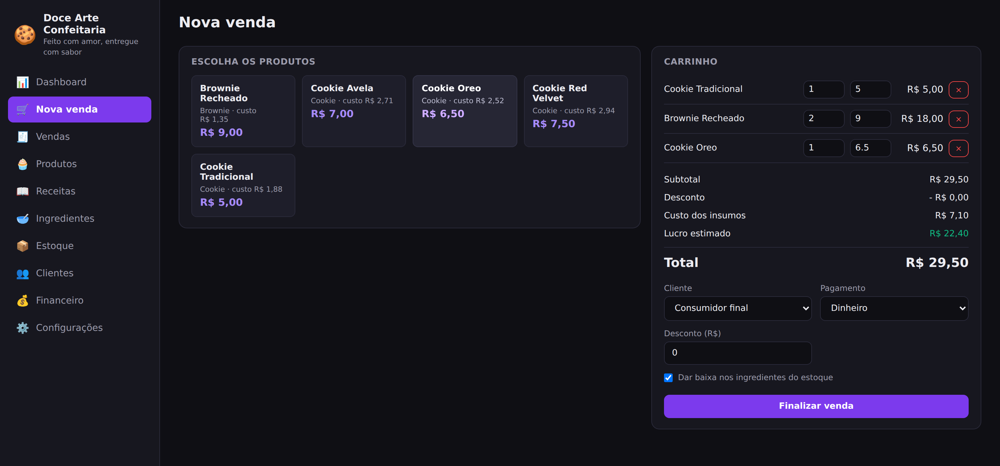
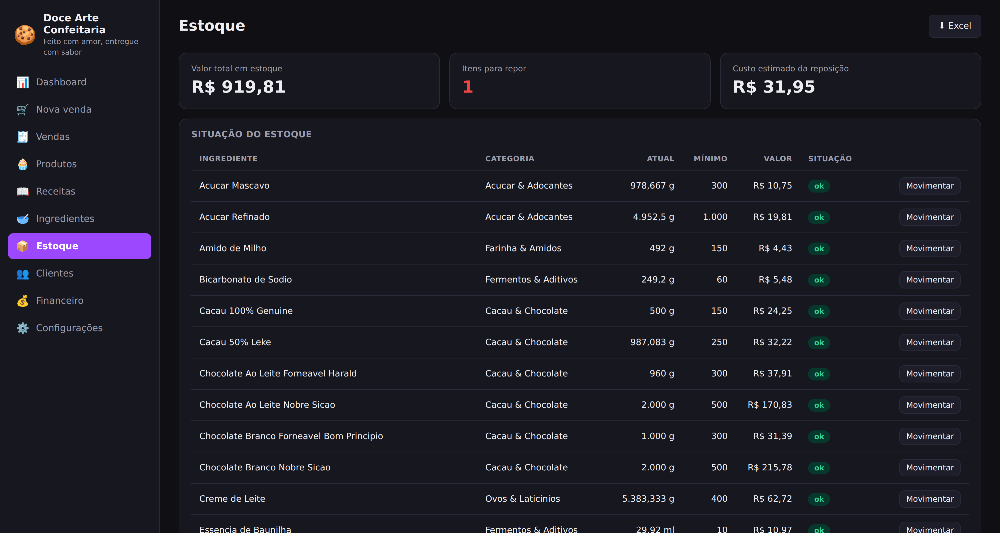
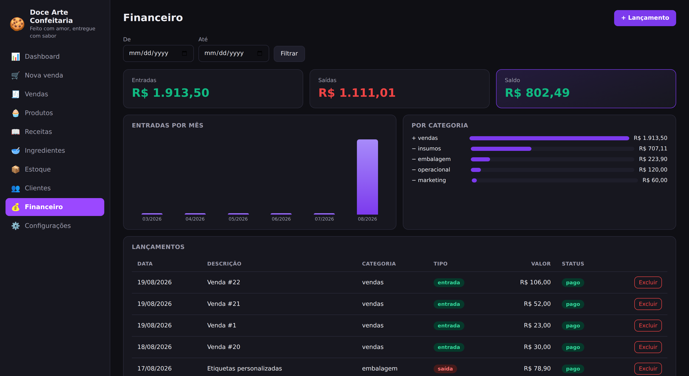

# ERP Doces

**Sistema de gestão para confeitaria: descobre o custo real de cada doce, controla o estoque de ingredientes e mostra se o preço de venda está dando lucro.**

Construído em cima de receitas e preços de compra reais — não são dados de exemplo. A pergunta que originou o projeto foi simples e difícil de responder na planilha: *quanto custa, de verdade, um cookie?*



---

## O problema

Quem produz doce para vender costuma precificar por comparação: olha o preço da concorrência, chuta um valor e torce para fechar o mês no azul. O custo real é difícil de calcular à mão porque:

- Os ingredientes são comprados em embalagens (pacote de 5 kg, cartela de 30 ovos, balde de 5 kg) mas usados em gramas e unidades
- Uma receita rende 15 cookies, então o custo precisa ser dividido pelo rendimento
- Quando o preço da manteiga sobe, **toda** receita que leva manteiga muda de custo — e todo produto feito com ela muda de margem
- Recheio, cobertura e massa têm custos muito diferentes entre si

O resultado disso é o que o sistema resolve: dá para ver que **o recheio e o chocolate sozinhos são 63% do custo do Cookie Red Velvet**, e que o Brownie, mais barato de produzir, tem margem de 85% contra 60% dos cookies.



---

## O que o sistema faz

**Calcula o custo sozinho e mantém atualizado.** Você informa quanto pagou na embalagem — "R$ 20,00 no pacote de 5 kg de farinha" — e o sistema converte para R$ 0,004 por grama. A partir daí, toda receita que usa farinha já sabe seu custo. Se o preço subir, as receitas e os produtos se atualizam na hora, sem ninguém recalcular nada.

**Mostra onde o dinheiro está indo.** A ficha técnica ordena os ingredientes pelo peso no custo, com o percentual de cada um. É o que revela que trocar o chocolate da massa muda mais o custo do que economizar na farinha.

**Sugere preço pela margem desejada.** Em vez de chutar, você diz "quero 60% de margem" e o sistema devolve o preço que entrega isso.

**Dá baixa no estoque conforme vende.** Ao registrar a venda de 6 cookies, os ingredientes proporcionais saem do estoque — inclusive convertendo unidades. Quem produz antes e vende depois pode usar o botão *Produzir*, que baixa os insumos de uma fornada inteira.

**Avisa o que precisa comprar.** Ingredientes abaixo do mínimo viram uma lista de compras com quantidade e custo estimado.

| Frente de venda | Estoque com histórico |
| :---: | :---: |
|  |  |

O financeiro fecha o ciclo: cada venda concluída vira entrada no caixa, as despesas são lançadas por categoria, e o saldo do mês aparece no dashboard.



---

## A parte técnica interessante: onde ficam os cálculos

A decisão de projeto mais relevante foi **colocar o cálculo de custo no banco de dados, em triggers, e não na aplicação.**

O motivo: o custo de uma receita depende de dados que mudam por vários caminhos diferentes — alguém edita o preço de um ingrediente, troca a quantidade de uma receita, ou registra uma compra com preço novo. Se o cálculo morasse só no Python, cada um desses caminhos precisaria lembrar de recalcular, e um esquecimento deixaria o custo errado em silêncio.

Com trigger, a regra fica em um lugar só e vale para qualquer origem — inclusive um `UPDATE` manual pelo pgAdmin:

```sql
-- Mudou o custo de compra de um insumo -> recalcula toda receita que o usa
CREATE TRIGGER ingredientes_propagar_custo
    AFTER UPDATE OF custo_unitario, unidade_medida ON ingredientes
    FOR EACH ROW
    WHEN (OLD.custo_unitario IS DISTINCT FROM NEW.custo_unitario
       OR OLD.unidade_medida IS DISTINCT FROM NEW.unidade_medida)
    EXECUTE FUNCTION trg_ingrediente_propagar_custo();
```

A cadeia funciona em efeito dominó: ingrediente → receitas que o usam → produtos ligados a essas receitas. Cada etapa é uma trigger simples; juntas, mantêm tudo coerente.

**Outras decisões que valem menção:**

- **A conversão de unidade existe nos dois lados** (`converter_unidade()` no PostgreSQL e em Python), porque tanto o banco quanto o serviço de baixa de estoque precisam dela. Kg↔g e l↔ml são convertidos; unidades incompatíveis não quebram o cálculo.
- **O custo é congelado no item da venda.** Quando o preço do chocolate sobe, o relatório do mês passado continua mostrando o lucro que realmente aconteceu.
- **Views para leitura, tabelas para escrita.** O dashboard lê de views (`vw_dashboard_kpis`, `vw_estoque`, `vw_vendas_por_dia`), o que mantém as consultas do Python curtas e concentra a lógica de relatório no SQL.
- **API assíncrona.** FastAPI com SQLAlchemy 2.0 async e asyncpg.
- **Frontend sem dependência externa.** HTML, CSS e JavaScript puro, servidos pela própria API. Sem build, sem `node_modules` — abre e funciona.

---

## Tecnologias

| Camada | Ferramentas |
| --- | --- |
| API | Python 3.11, FastAPI, SQLAlchemy 2.0 (async), Pydantic v2 |
| Banco | PostgreSQL — triggers, views e funções em PL/pgSQL |
| Frontend | HTML, CSS e JavaScript puro (sem framework) |
| Relatórios | openpyxl (Excel) e ReportLab (PDF) |
| Publicação | Vercel (funções serverless) + Neon (PostgreSQL gerenciado) |

---

## Rodando na sua máquina

Pré-requisitos: Python 3.11+ e PostgreSQL 14+.

```bash
# 1. Banco
createdb erp_confeitaria
psql -d erp_confeitaria -f schema.sql   # tabelas, funções e triggers
psql -d erp_confeitaria -f views.sql    # views de dashboard e relatórios
psql -d erp_confeitaria -f seeds.sql    # dados iniciais

# 2. Projeto
python -m venv venv && source venv/bin/activate   # Windows: venv\Scripts\activate
pip install -r requirements.txt
cp .env.example .env      # preencha a senha do banco

# 3. Conferir e subir
python testar_ambiente.py
uvicorn app.main:app --reload
```

Sistema em <http://localhost:8000> · documentação da API em <http://localhost:8000/docs>

> `seeds.sql` recria os dados de cadastro do zero. Rode na primeira vez, ou quando quiser voltar ao estado inicial.

### Publicando (Vercel + Neon)

O repositório já vem preparado: `api/index.py` expõe a API e `public/` é servida como site estático.

1. Crie um banco grátis no [Neon](https://neon.tech) e rode `schema.sql`, `views.sql` e `seeds.sql` no SQL Editor
2. Instale o [app do Vercel no GitHub](https://github.com/apps/vercel) e importe este repositório
3. Em *Settings → Environment Variables*, crie `DATABASE_URL` com a string de conexão do Neon

A string pode ser colada como o Neon mostra — o sistema converte para o driver assíncrono, ativa SSL e descarta parâmetros que o asyncpg não aceita. A senha fica só na variável de ambiente, nunca em arquivo versionado.

---

## Estrutura

```
ERP-Doces/
├── app/
│   ├── main.py            # aplicação FastAPI, CORS e arquivos estáticos
│   ├── config.py          # leitura do .env
│   ├── database.py        # conexão assíncrona e tratamento da URL do banco
│   ├── models.py          # tabelas (SQLAlchemy)
│   ├── schemas.py         # validação de entrada e saída (Pydantic)
│   ├── services.py        # baixa de estoque e consumo de receita
│   └── routers/           # endpoints por módulo
├── public/                # interface web (index.html, css/, js/)
├── api/index.py           # ponto de entrada do Vercel
├── schema.sql             # tabelas, funções e triggers de cálculo
├── views.sql              # views de dashboard e relatórios
├── seeds.sql              # dados iniciais
└── testar_ambiente.py     # checagem de instalação e conexão
```

### Principais endpoints

| Método | Rota | Para quê |
| --- | --- | --- |
| `GET` | `/api/dashboard/kpis` | Números do topo do dashboard |
| `GET` | `/api/receitas/{id}` | Ficha técnica com custo por ingrediente |
| `POST` | `/api/receitas/{id}/produzir` | Baixa os insumos de uma fornada |
| `POST` | `/api/ingredientes/{id}/preco-compra` | Converte preço de embalagem em custo unitário |
| `GET` | `/api/produtos/{id}/preco-sugerido?margem=60` | Preço para a margem desejada |
| `POST` | `/api/vendas` | Registra venda, financeiro e baixa de estoque |
| `GET` | `/api/relatorios/lista-compras` | O que comprar e quanto vai custar |
| `GET` | `/api/relatorios/ficha-tecnica/{id}.pdf` | Ficha técnica em PDF |

Lista completa em `/docs`.

---

## Limitações conhecidas

- **Não tem autenticação.** Foi pensado para uso local, em uma máquina. Publicado em endereço público, qualquer pessoa com o link acessa — colocar login é o próximo passo natural.
- **Serverless cobra seu preço.** Na Vercel, a primeira requisição depois de um tempo parado demora (cold start), e a geração de PDF é pesada para esse formato. Rodando como servidor comum o comportamento é melhor.
- **A conversão de unidade não cobre densidade.** Converter gramas para mililitros exigiria saber a densidade de cada ingrediente; hoje unidades incompatíveis são tratadas 1:1.
